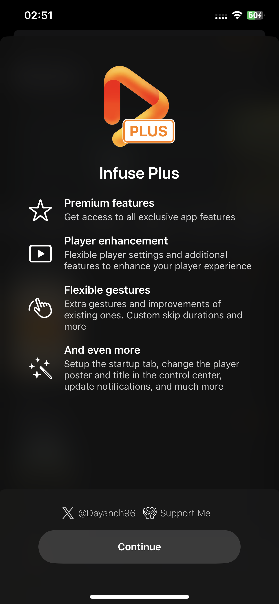
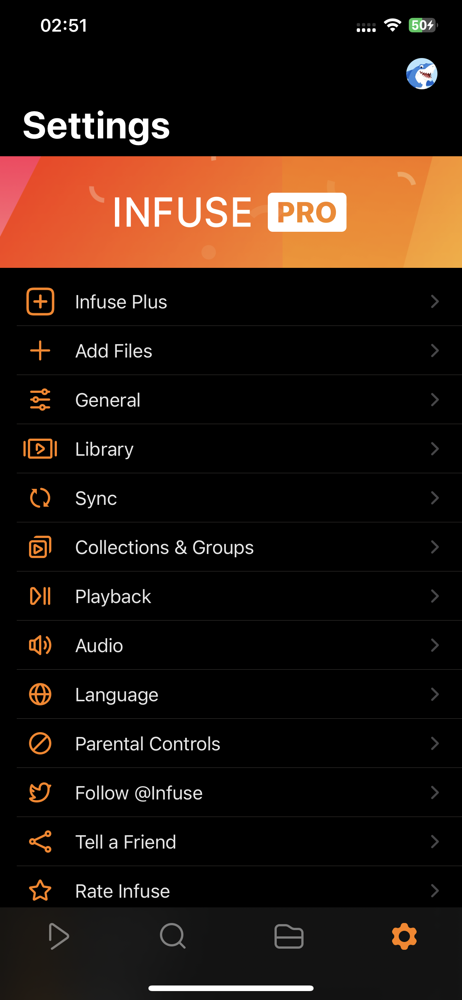
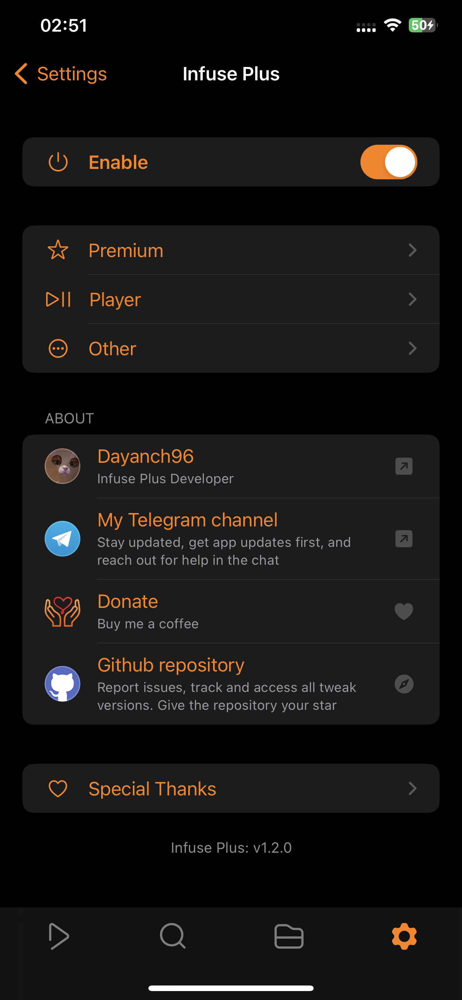
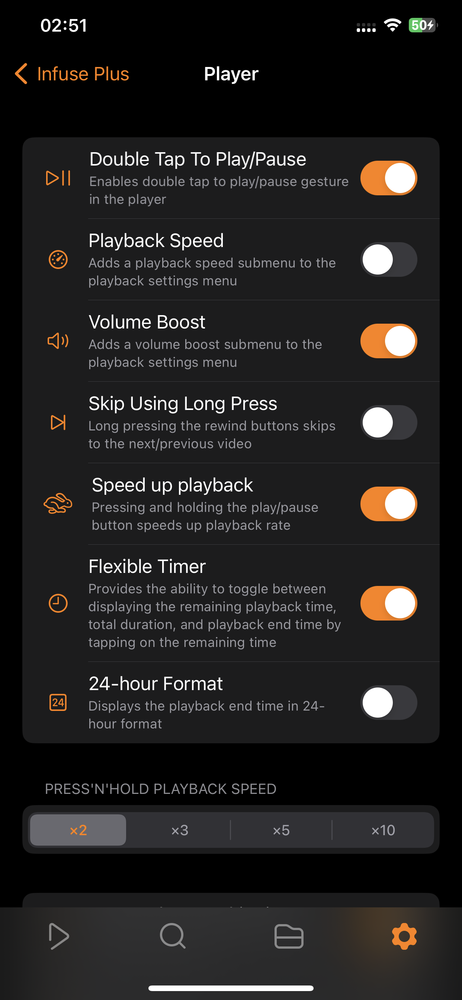
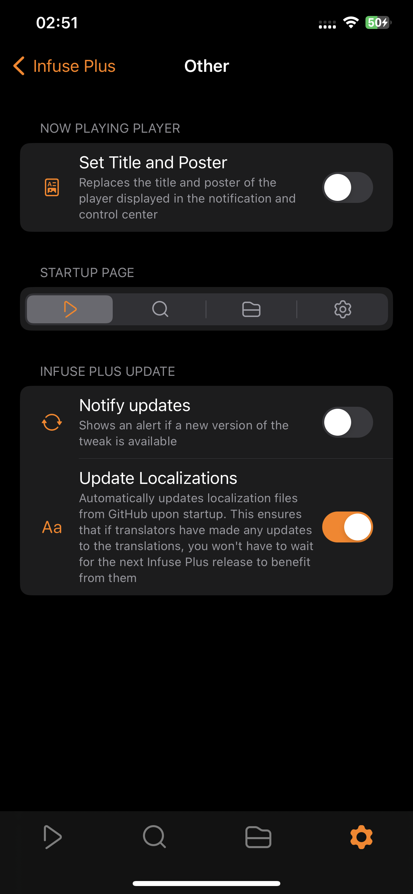
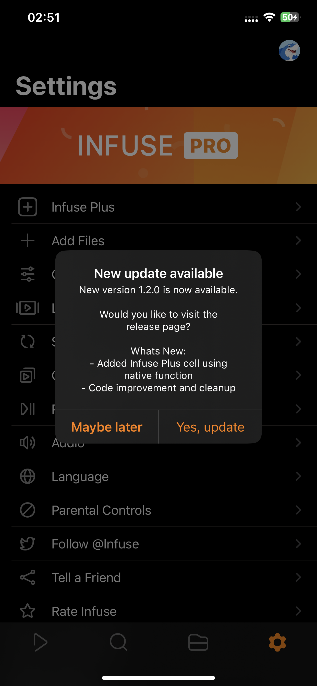

# InfusePlus

Enhancer for <a href="https://apps.apple.com/us/app/id1136220934">Infuse</a>

## Screenshots
<table>
   <tr>
      <td></td>
      <td></td>
      <td></td>
   </tr>
</table>

  
More screenshots

  <table>
    <tr>
      <td></td>
      <td></td>
      <td></td>
    </tr>
  </table>

## Features

  
Premium settings

  <ul>
    <li>Pro features</li>
    <li>Background playback</li>
  </ul>

  
Player settings

  <ul>
    <li>Play/Pause playback using double tap</li>
    <li>Playback speed settings in context menu</li>
    <li>Volume boost settings in context menu</li>
    <li>Skip to the Next/Previous using long press on rewind buttons</li>
    <li>Speed up playback by long pressing Play/Pause button
      <ul>
        <li>Adjustable playback rate</li>
      </ul>
    </li>
    <li>Tap to playback duration to change between total duration, left duration and exact time when playback ends</li>
    <li>Separated custom skip times for double tap and rewind buttons</li>
  </ul>

  
Other settings

  <ul>
    <li>Ability to set Title and Poster for the player in control center</li>
    <li>Startup tab selection</li>
    <li>New available tweak update notification</li>
    <li>Auto-update localizations</li>
  </ul>

**Infuse Plus preferences can be found in the Settings tab**
